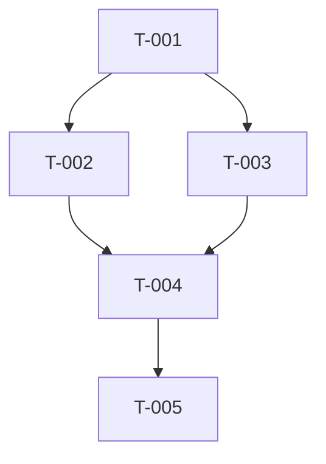

# Epics & Tasks Template

Use this template to generate `docs/epics-and-tasks.md`. This is the document most directly consumed by an AI coding agent. Each task must be granular enough for an agent to complete in a single session. Align tasks with `technical-specs.md` (default: **REST API** + **database** + optional integrations); when the repository or toolchain is not fixed yet, keep **Repo binding** and toolchain-specific DoD lines as `TBD` and refine after bootstrap.

---

```markdown
# [Product Name] — Epics & Tasks

**Version:** 1.0
**Date:** [YYYY-MM-DD]
**Related PRD:** [prd.md](prd.md)
**Related Stories:** [user-stories.md](user-stories.md)

## How to Use This Document

Each epic groups related work. Each task within an epic is designed to be
executed by an AI coding agent in a single session. Tasks are ordered by
dependency — complete them top to bottom within each epic.

**Task statuses:** Not Started | In Progress | Done | Blocked

## Epic Overview

| Epic ID | Name | Stories | Task Count | Priority |
|---------|------|---------|------------|----------|
| EP-001 | [Epic Name] | US-001, US-002 | [N] | Must Have |
| EP-002 | [Epic Name] | US-003, US-004 | [N] | Must Have |
| EP-003 | [Epic Name] | US-005 | [N] | Should Have |

## Recommended Execution Order

List epics in the order they should be implemented, considering dependencies:

1. **EP-001** — [Reason: foundational, no dependencies]
2. **EP-002** — [Reason: depends on EP-001 data model]
3. **EP-003** — [Reason: depends on EP-001 and EP-002]

---

## EP-001: [Epic Name]

**Goal:** [One sentence describing what this epic achieves]
**Stories:** US-001, US-002
**Depends on:** None | EP-XXX

### T-001: [Task Title]
- **Story:** US-001
- **Status:** Not Started
- **Contract references:** [Pointers to `technical-specs.md` sections or tables, e.g. §3.1 Create User, §2.1 User entity]
- **Assumptions:** [Explicit, e.g. auth already exists from T-00X; or "none"]
- **Repo binding:** [Concrete paths, packages, or commands—use `TBD` until the repo exists, then fill in a refinement pass]
- **Description:** [Precise description of what to build or change]
- **Definition of Done (contract / behavior):**
  - [ ] [Specific, verifiable product or API outcome]
  - [ ] [Specific, verifiable product or API outcome]
- **Definition of Done (toolchain — when repo exists):**
  - [ ] [Tests pass / linter clean / build succeeds — or TBD]
- **Agent Instructions:**
  - [Specific constraints or patterns the agent must follow]
  - [Files or directories to create/modify — or TBD]
  - [What NOT to do]
- **Depends on:** None | T-XXX

### T-002: [Task Title]
- **Story:** US-001
- **Status:** Not Started
- **Contract references:** [...]
- **Assumptions:** [...]
- **Repo binding:** [...]
- **Description:** [Precise description]
- **Definition of Done (contract / behavior):**
  - [ ] [Outcome]
  - [ ] [Outcome]
- **Definition of Done (toolchain — when repo exists):**
  - [ ] [Outcome — or TBD]
- **Agent Instructions:**
  - [Instructions]
- **Depends on:** T-001

---

## EP-002: [Epic Name]

[Same structure. Repeat for each epic.]

---

## Dependency Graph

Visualize task dependencies for complex projects:



## Progress Tracker

| Task | Epic | Status | Depends On |
|------|------|--------|------------|
| T-001 | EP-001 | Not Started | — |
| T-002 | EP-001 | Not Started | T-001 |
| T-003 | EP-002 | Not Started | T-001 |
```

## Guidelines for Writing Tasks

- **One concern per task.** A task should touch a focused area of the codebase.
- **Link to the contract.** Use **Contract references** so the task maps cleanly to `technical-specs.md`. Call out **Assumptions** so a stateless agent does not guess hidden dependencies.
- **Repo binding.** Once a repository exists, fill **Repo binding** and toolchain DoD items with real paths and commands; before that, `TBD` is acceptable if behavior-level DoD is complete.
- **Include Agent Instructions.** These are direct instructions for the AI agent: what patterns to follow, what files to touch, what to avoid.
- **Definition of Done must be verifiable.** Split **behavior/contract** outcomes (always) from **toolchain** checks (tests, linter, build) when the project’s commands are known; prefer automated checks where they exist.
- **Order by dependency.** The agent should be able to pick up tasks top to bottom without needing to jump around.
- **Size tasks for a single agent session.** If a task would take a human more than 2-4 hours, break it down further.
- **Never leave implicit context.** The agent has no memory of previous tasks. Each task must be self-contained with enough context to execute.
