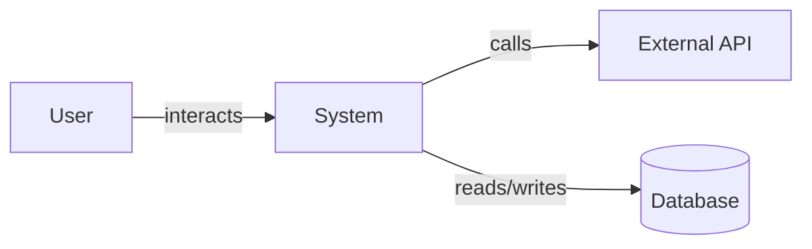
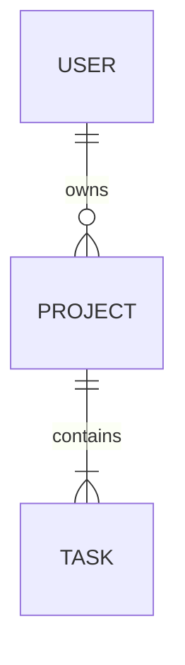

# Technical Specifications Template

Use this template to generate `docs/technical-specs.md`. This document translates product requirements into technical boundaries and constraints without prescribing implementation (unless the user has chosen a tech stack).

---

```markdown
# [Product Name] — Technical Specifications

**Version:** 1.0
**Date:** [YYYY-MM-DD]
**Related PRD:** [prd.md](prd.md)

## 1. System Overview

### 1.1 Architecture Summary
[High-level description of the system architecture. If tech stack is defined, state it. If not, describe the architecture in abstract terms (e.g. "client-server", "event-driven", "serverless").]

### 1.2 System Context Diagram
[Describe the system boundaries: what is inside the system vs. external. Use a Mermaid diagram if helpful:]



## 2. Data Model

### 2.1 Core Entities

| Entity | Description | Key Attributes |
|--------|-------------|----------------|
| [e.g. User] | [Description] | id, email, name, role, created_at |
| [e.g. Project] | [Description] | id, owner_id, title, status, created_at |

### 2.2 Entity Relationships
[Describe relationships between entities. Use a Mermaid ER diagram if helpful:]



### 2.3 Data Constraints
- [e.g. Email must be unique per user]
- [e.g. Project title max 200 characters]
- [e.g. Soft deletes required for all entities]

## 3. API Boundaries

### 3.1 API Surface

Define the public interfaces the system exposes. Do NOT prescribe REST vs GraphQL unless the user has decided.

| Endpoint/Operation | Purpose | Related Feature |
|--------------------|---------|-----------------|
| [e.g. Create User] | [Registers a new user] | F-001 |
| [e.g. List Projects] | [Returns user's projects] | F-003 |

### 3.2 Authentication & Authorization
- [Authentication method if decided, or "TBD - requires auth mechanism"]
- [Authorization model: RBAC, ABAC, or describe roles and permissions]

| Role | Permissions |
|------|------------|
| [e.g. Admin] | [Full CRUD on all resources] |
| [e.g. Member] | [Read all, write own resources] |

## 4. Integration Points

| System | Direction | Protocol | Purpose | Related Feature |
|--------|-----------|----------|---------|-----------------|
| [e.g. Stripe] | Outbound | [REST API] | [Payment processing] | F-005 |
| [e.g. SendGrid] | Outbound | [SMTP/API] | [Email notifications] | F-002 |

## 5. Non-Functional Specifications

### 5.1 Performance Budgets

| Metric | Target | Measurement |
|--------|--------|-------------|
| [e.g. First Contentful Paint] | [< 1.5s] | [Lighthouse] |
| [e.g. API p95 latency] | [< 200ms] | [APM tool] |

### 5.2 Security Requirements
- [e.g. Data encrypted at rest (AES-256) and in transit (TLS 1.3)]
- [e.g. Input validation on all user-facing endpoints]
- [e.g. Rate limiting on authentication endpoints]

### 5.3 Observability
- [Logging requirements]
- [Metrics to track]
- [Alerting thresholds]

## 6. Infrastructure Constraints

[Only include if the user has provided infrastructure preferences. Otherwise, leave as open decisions.]

- [e.g. Must deploy to AWS / GCP / Cloudflare]
- [e.g. Budget constraint: < $X/month for infrastructure]
- [e.g. Must support CI/CD pipeline]

## 7. Technical Risks

| Risk | Probability | Impact | Mitigation |
|------|-------------|--------|------------|
| [e.g. Third-party API rate limits] | Medium | High | [Implement caching and retry logic] |

## 8. Glossary

| Term | Definition |
|------|-----------|
| [Domain term] | [Clear definition for agent context] |
```
